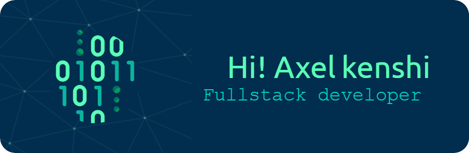

  

---

  

###

<h1 align="left">Hey 👋 What's up?</h1>

###

Hi, I’m Axel — a future-focused developer from Bandung city, Indonesia (🇮🇩), currently sharpening my passion in computer science at vocational high school. I specialize in scalable solutions, technical workflows, and creative coding.

###

<h2 align="left"> 🌱 A little bit About me</h2>

###

✨ Fullstack Web Dev 📚 I'm currently learning Data Science 🎯 Goals: AI Enggineer 🎲 Fun fact: Likes weird AI Models 🎭 Pronoun: Xell 💡 Philosophy: Code with clarity, brand with boldness, building with purpose. 🧠 Thinking Style: Detail-oriented & creatively curious

###

<h2 align="left">Connect With Me!</h2>

###

  
    
  </a>
  
    
    </a>
    

---

<h2 align="center">My Tech Stack</h2>

###

<h2 align="center">tools that I use frequently</h2>

  

---

  
  

###

<picture>
  <source media="(prefers-color-scheme: dark)" srcset="https://raw.githubusercontent.com/axelkenshi/axelkenshi/output/pacman-contribution-graph-dark.svg">
  <source media="(prefers-color-scheme: light)" srcset="https://raw.githubusercontent.com/axelkenshi/axelkenshi/output/pacman-contribution-graph.svg">
  
</picture>

---

  

> [!TIP]
> Becoming a skilled software engineer isn't easy; not everyone can achieve it. It requires a sharp effort and a deep understanding. Creating applications isn't as easy as it sounds. Someone who can only do the basics won't make an impact. The skills you acquire aren't just for competition, but for realizing your dreams.

> Even after you reach an advanced level, learning never stops, with trial and error, until you're able to create something with the creativity and skills you possess to make it happen.

> The long journey is a process that should be enjoyed, gradually achieving your goals, facing challenges that make you think about giving up.
Experience is the practice of theory, transforming it into expertise.

> Keep Grinding!
