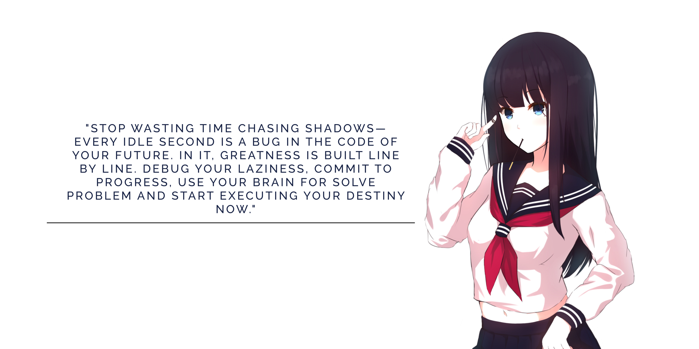

  

---

<h1 align="left">Hey, What's up? 🙋‍♂️</h1>

Hi, I’m Axel — a student developer from Bandung, Indonesia (🇮🇩) with a deep interest in how software can solve real-world problems. Currently, I'm sharpening my foundation in Computer Science at a vocational high school, where I've fallen in love with the process of building clean and purposeful digital products. 

Beyond the classroom, I immerse myself in Flutter development and AI-driven automation. I don't just want to write code; I strive to write it elegantly and maintainably. Driven by curiosity, I'm constantly experimenting with the synergy between technical logic and creative branding—always building with a 'purpose-first' mindset.

<h2 align="left">🌱 A little bit About me</h2>

  🎭 <b>Pronoun:</b> Axel ヾ(＠⌒ー⌒＠)ノ 
  ✨ <b>Education:</b> Student at <a href="https://www.instagram.com/smkbinawisatalembang_official">@BinaWisata</a> Vocational High School 
  🌐 <b>Portfolio:</b> <a href="https://portofolio.luminarysirx.my.id">AxelkenshiDev</a> 
  📚 <b>Currently Learning:</b> Flutter & Mobile Development 
  🎯 <b>Goals:</b> Building impactful open-source projects 
  🎲 <b>Fun fact:</b> Really like exploring the latest AI trends 
  💡 <b>Philosophy:</b> Code with clarity, brand with boldness, building with purpose. 
  🧠 <b>Thinking Style:</b> Detail-oriented & creatively curious

---

<table border="0" style="border-collapse: collapse; width: 100%;">
  <tr>
    <!-- Bilah kiri: sosmed -->
    <td align="left" valign="top" style="border: none;">
      <h3>🌐 Let's Connect With Me</h3>
      
      
      
      
    </td>
    <!-- JARAK ANTAR KOLOM -->
      <td width="50" style="border: none;"></td>
    <!-- Bilah kanan: resume -->
    <td align="left" valign="top" style="border: none;">
      <h3>📜 Grab My Resume (PDF)</h3>
      
    </td>
  </tr>
</table>

---

<h2 align="center">🥶 My Tech Stack</h2>

###

<h2 align="center">🤔 Familiar With</h2>

<h2 align="center">🛠️ Tools & Environments</h2>

  

---

###

<h1 align="center">🚀 Featured Projects</h1>

---

<h1 align="center">📊 My Productivity</h1>

  
  

<picture>
  <source media="(prefers-color-scheme: dark)" srcset="https://raw.githubusercontent.com/axelkenshi/axelkenshi/output/pacman-contribution-graph-dark.svg">
  <source media="(prefers-color-scheme: light)" srcset="https://raw.githubusercontent.com/axelkenshi/axelkenshi/output/pacman-contribution-graph.svg">
  
</picture>

---

  

> [!TIP]
> The long journey is a process that should be enjoyed, gradually achieving your goals, facing challenges that make you think about giving up. Experience is the practice of theory, transforming it into expertise.
> 
> **Keep Grinding!**

  

<!-- 

  

 -->
